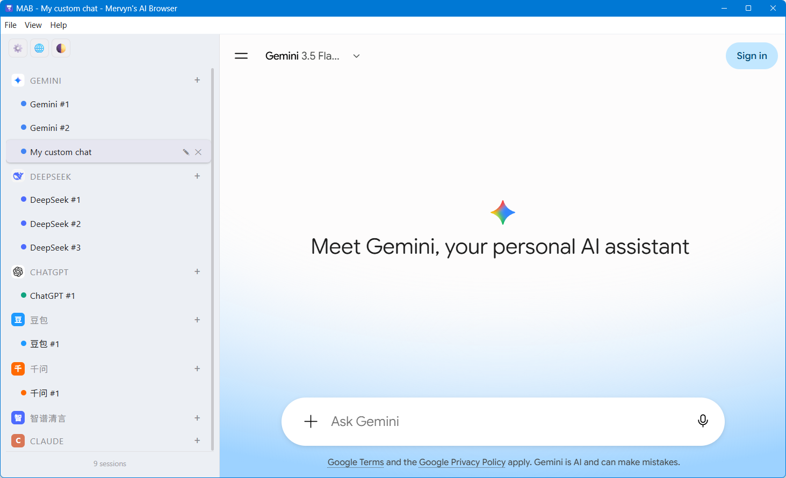
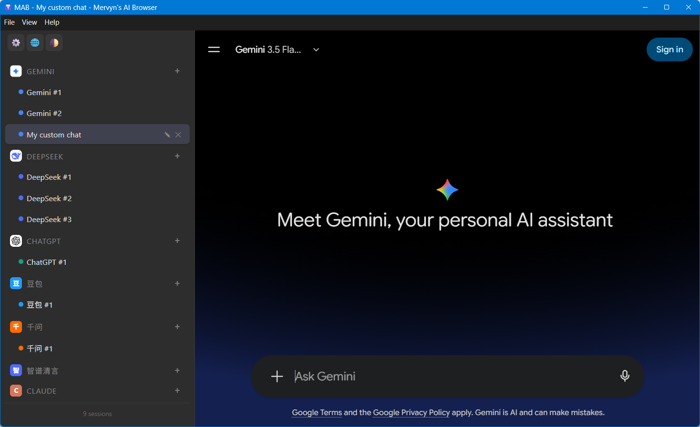

[English](README.md) · [中文](README.zh-CN.md)

# Mervyn's AI Browser

A multi-session AI browser built with Electron. Open Gemini, DeepSeek, ChatGPT, Doubao, Qwen, Zhipu AI, and Claude side by side in isolated, persistent sessions.

English is the default UI language.

## Screenshot

**Light mode**



**Dark mode**



## Features

- **Multi-session tabs** — Create multiple sessions per AI tool; each session keeps its own page state.
- **Persistent login** — Sessions are isolated via Electron `persist:` partitions, so login state survives restarts (same machine).
- **Session restore** — Tabs, active tab, window size, and sidebar width are restored on the next launch.
- **Proxy support** — Per-tool proxy via the `AI_BROWSER_PROXY` environment variable (applied only to tools flagged `needsProxy`).
- **Auto-launch** — Optional "Launch at startup" toggle in Settings.
- **Auto retry** — Transient network errors (e.g. proxy not ready yet) are retried automatically instead of showing an error page.
- **Context menu & app menu** — Back / forward / reload / zoom / DevTools, plus right-click copy / paste / cut / reload.

## Development

```bash
npm install
npm start          # run in development mode (electron .)
```

## Build

```bash
npm run dist       # build installer -> dist/Mervyn's AI Browser Setup x.x.x.exe
npm run pack       # build unpacked directory only -> dist/win-unpacked/
```

The build output goes to `dist/` as an NSIS installer (selectable install directory, desktop + start menu shortcuts).

## Data location

User data (tabs, login state) is stored at:

```
C:\Users\<username>\AppData\Roaming\MyAIBrowser
```

- Reinstalling or restarting on the same PC keeps tabs and login state.
- Moving to another PC requires re-login (Windows encrypts cookies per machine).

## Settings

Open **Settings** from the sidebar footer:

| Option | Description |
| --- | --- |
| Launch at startup | Add the app to the system login items. |

> **Proxy** is not set in the UI. Configure it through the environment variable below.

## Proxy configuration

Set the `AI_BROWSER_PROXY` environment variable before launching (e.g. `http=127.0.0.1:7890;https=127.0.0.1:7890`). It is only applied to tools with `needsProxy: true`.

```bash
# Windows (PowerShell)
$env:AI_BROWSER_PROXY = "http=127.0.0.1:7890;https=127.0.0.1:7890"
npm start
```

## Customizing AI tools

Edit the `AI_TOOLS` object at the top of `main.js` to add or remove AI tools:

| Field | Description |
| --- | --- |
| `name` | Display name (also used as the default tab name). |
| `url` | Home URL loaded for the tool. |
| `icon` | Short text badge shown in the sidebar (e.g. `GPT`, `豆`). |
| `color` | Brand color for the sidebar dot/badge. |
| `logo` | Optional path to a logo image (`assets/logos/<name>.png`). |
| `needsProxy` | `true` to route this tool through `AI_BROWSER_PROXY`. |

Tool logos live in `assets/logos/`. The app icon (`assets/icon.ico`) takes effect after rebuild.

To regenerate the icon, run `python gen_icon.py` (writes `assets/icon.ico`).

## Security notes

- `nodeIntegration` is disabled and `contextIsolation` is enabled everywhere.
- The AI-site views run in a `sandbox: true` and use isolated `persist:` partitions.
- The sidebar UI sets a strict Content-Security-Policy and uses `textContent` / `CSS.escape` to avoid injection.
- No credentials are hardcoded; login state is stored locally in the user data directory.
- The preload script exposes only a minimal, scoped API through `contextBridge`.

## Trademark & brand notice

This software is an independent, unofficial project and is **not affiliated with, endorsed by, or sponsored by** any AI service provider.

The brand names, logos, and trademarks of ChatGPT/OpenAI, Gemini/Google, DeepSeek, Doubao/ByteDance, Qwen/Alibaba, Zhipu AI, Claude/Anthropic, and any other services referenced here are the property of their respective owners. Any such logos included in `assets/logos/` are used solely as functional indicators to identify each service within the app's UI, and do not imply any relationship with the respective companies.

All other trademarks, service marks, and trade names referenced in this project are the property of their respective holders.

## License

MIT © 2026 Mervyn — see [LICENSE](LICENSE).
